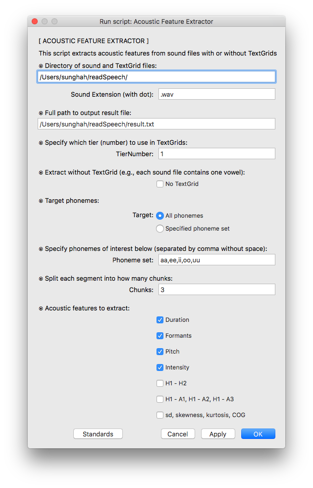

# [AFE] - Acoustic Feature Extractor
---
**AFE** is a praat script for which to extract  acoustic properties including duration, pitch, intensity and spectral qualities.

<br />

## GUI
Run script in Praat
<p align="center">
  
</p>


## Command Line Usage
``` bash
# run script by specifying arguments
/usr/bin/praat --run AFE.praat \
  "/home/wavtextgrid/" ".wav" "/home/result.txt" 1 0 "All phonemes" " " 3 1 1 1 1 0 0 0

# using `nohup` recommended in case of a long running process
nohup /usr/bin/praat --run AFE.praat \
  "/home/wavtextgrid/" ".wav" "/home/result.txt" 1 0 "All phonemes" " " 3 1 1 1 1 0 0 0 > log &

# For more information, refer to:
#   http://www.fon.hum.uva.nl/praat/manual/Scripting_6_9__Calling_from_the_command_line.html
#   http://www.fon.hum.uva.nl/praat/manual/Scripting_6_1__Arguments_to_the_script.html
```


